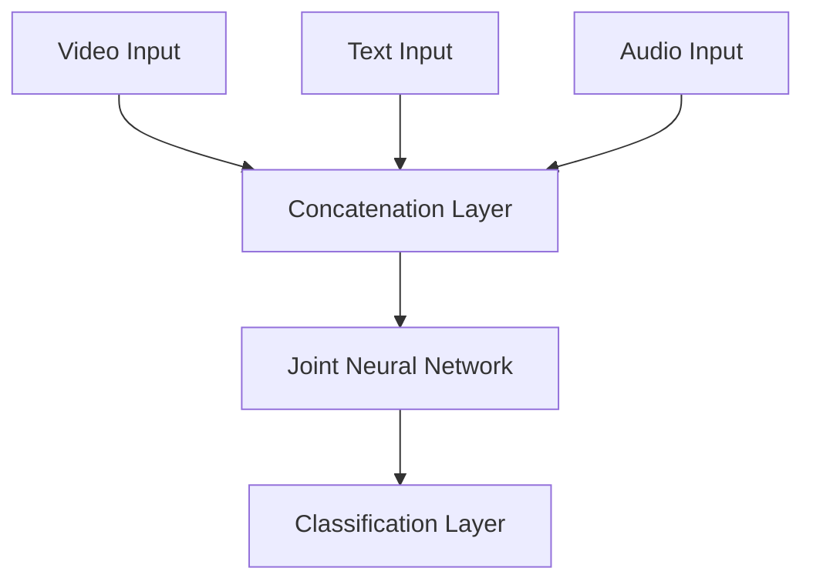
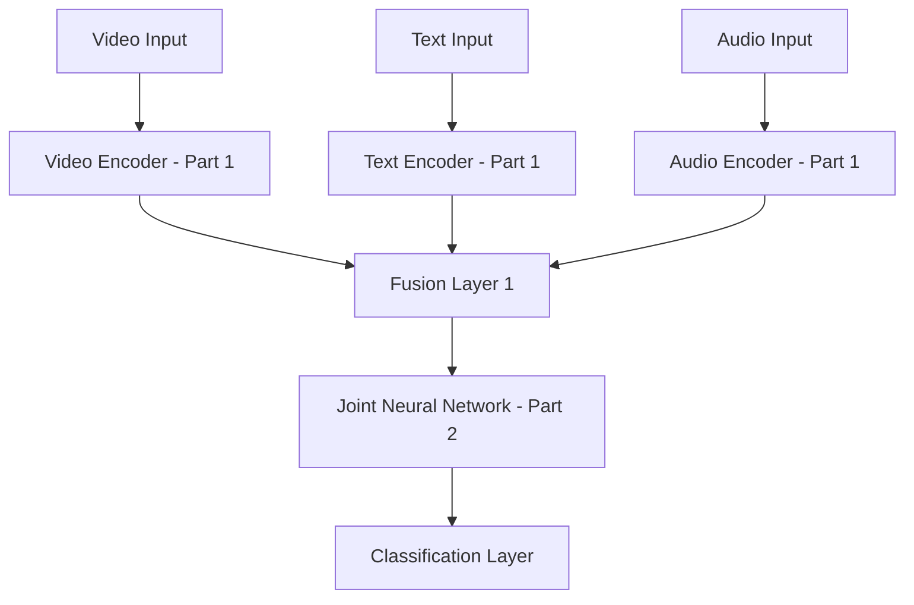
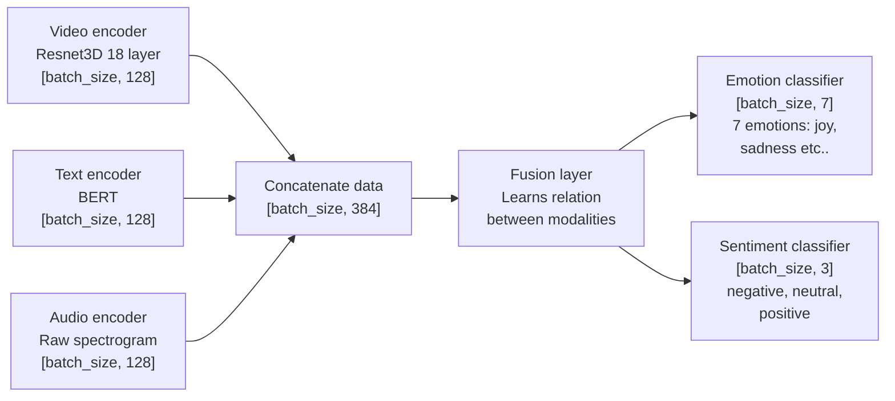

## what exactly are we going to build?
* i am buling the sentinment analysis of video
* a video will be uoload to the system , go to the model and then give the output as sentinment analysis of the video.
* sentiment can  be. negative , positive or neutral.
* emotions can be happy , sad , angry , fear , surprise , disgust , neutral.
* use case: people might need analysis of a video for a number of diff cases.
  * for example : a company might want to know how their ad is being perceived by the audience.
  * or a content creator might want to know how their video is being received by the audience.
  * or a researcher might want to analyze the sentiment of a video for their study.


## about the dataset 
* the dataset i use s the meld datsaset which taken a bunck of ep from show "friends"
* the dataset is 10gb so remember do dowload it.

## neurons netork architecture:


* how individual neurons work:
* each neuron takes multiple inputs, applies weights to them, sums them up, adds a bias, and then passes the result through an activation function to produce an output. it will  do some computaion on the input data and then pass the result to the next layer of neurons.
* each inout have some weight associated with it which tells how important that input is.
* ' the neuron itself also has bias which is added to the weighted sum of inputs to shift the activation function.
* and then the outout is the calculation done by the neuron after applying the activation function along with inouts , weights and bias.
* i.e y = f(w1*x1 + w2*x2 + ... + wn*xn + b) where f is the activation function.
* w1*x1 + w2*x2 + ... + wn*xn + b is linear func, usually model will be veru smart if we only use linear function so we use activation function to introduce non-linearity.
## why activation function is needed?
* without activation function the neural network would just be a linear regression model which is not capable of learning complex patterns in data.
* ' linearity prevents the network from learning and representing more complex functions.


## training theory:
y = sigmoid((x1*w1 + x2*w2)+b))
* all the weight and bisa the same in this case to make the calculation simple.
*  weight will  be 0.5 and b will be 0.
*  i real life scenario weight and bias will be random value.
*  
## training:
* before training the model the weight and bias are initialized randomly. 
* during traing , we use technique called backpropagation to update the weight and bias based on the error in the model's predictions. we bascically give ai "hints"l ike here is what an inout might look like and this is the expected output would look like. the model will beable to learrn the corraltion between input and output. => if the outout is way off, we will adjust the weight and bias to make the output closer to the expected output.
* after training: the model will get the input (which is kinda like what the model have seen before ) => model will recogizie that => outout guess are noew more accurate.
### what happen during training: 
* lower loss, better accuracy.
* how do we measure loss? mean squared error for regression tasks and cross-entropy loss for classification tasks., the correct answer with the model's prediction. => measure the mean of all errors.
* based onthat the lower loss by adjusting the weight and bias using optimization algorithms like gradient descent.
* to improve the network, we need to knoweach weight's and bias's contribution to the loss.  but loss fucntion depends pon all weights and biases in the network. L(w1, w2, ..., wn, b1, b2, ..., bm) => how to we know which one affects the loss how? really diff
* we use partial derivatives to measure how much each weight and bias affects the loss.
* gradient descent: we calculate the gradient of the loss function with respect to each weight and bias. => tells us the direction and magnitude of change needed to reduce the loss. => we update each weight and bias by moving in the opposite direction of the gradient.

* 
* for each weight and bias, we new know in which direction to tweak them to reduce the loss. but how much to tweak them? => learning rate.
* so to twear w1 we do: w1 = w1 - learning_rate * dL/dw1
* * do not use to small or too large learning rate. because too small => slow convergence , too large => overshooting the minimum loss.
* by repeating this process over many iterations (epochs), the model gradually learns the optimal weights and biases that minimize the loss function, leading to better performance on the training data.
## how back to trainign the modeL
* first werungung sample through network, obtain a loss => calculate partial derivatives for all wiéight wirght and bias => update weight and bias using learning rate and partial derivatives => repeat for many epochs until loss is minimized.

## underfittins vs overfitting
* underfitting: model is too simple to capture the underlying patterns in the data. => low accuracy on both training and validation data.
* overfitting: model is too complex and learns the noise in the training data as if it were a true pattern. => high accuracy on training data but low accuracy on validation data.
* to prevent overfitting: use techniques like regularization, dropout, and early stopping.


## respresnting data in deep learning 
* data need to be represented in numerical format for the model to process it.
* tensor = multi-dimensional array that hold data
* how to we take vode and encoding it:
  * extract frames from video at regular intervals (e.g., every second).
  * for each frame, use a pre-trained CNN (like VGG16 or ResNet) to extract features. this will convert each frame into a fixed-size feature vector.
  * stack the feature vectors of all frames to create a 2D array (num_frames x feature_vector_size).
  * if the number of frames varies between videos, we can pad the sequences with zeros or truncate them to a fixed length.
  * finally, the resulting 2D array can be reshaped into a 3D tensor (1 x num_frames x feature_vector_size) to be fed into the sentiment analysis model.
* example :
videO = [frame=3, channel=3, height=4, width=4]

how  we sotr in  a tensor:
video = torch.sensor([
                    # frame 1: req square in top left corner
                     [[[1.0, 1.0, 1.0, 1.0],
                       [1.0, 1.0, 1.0, 1.0],
                       [1.0, 1.0, 1.0, 1.0],
                       [1.0, 1.0, 1.0, 1.0]],

                      # frame 2: red square in top right corner
                      [[0.0, 0.0, 0.0, 1.0],
                       [0.0, 0.0, 0.0, 1.0],
                       [0.0, 0.0, 0.0, 1.0],
                       [0.0, 0.0, 0.0, 1.0]],

                      # frame 3: green square in bottom left corner
                      [[0.0, 1.0, 0.0, 0.0],
                       [0.0, 1.0, 0.0, 0.0],
                       [0.0, 1.0, 0.0, 0.0],
                       [0.0, 1.0, 0.0, 0.0]]],
                    ,)

* text: 
  * tokenization: breaking down text into smaller units (tokens) like words or subwords.
  * embedding: converting tokens into dense vectors that capture semantic meaning using techniques like Word2Vec, GloVe, or transformer-based models like BERT.
  * padding/truncating: ensuring all text sequences are of the same length by adding special padding tokens or truncating longer sequences.
  * final representation: the processed text can be represented as a 2D tensor (num_tokens x embedding_size) to be fed into the sentiment analysis model.
*audio:
  * encoding waveform that make up spunds

## back to our model
* we give model the video of frame, script and audio.
*  you can traini from scratch which is not use any pre-trained model, use more datam needs more trainig time, and might underperform compared to fine-tuning pre-trained models.
* you can use trabfer learning to fine-tune pre-trained models like VGG16, ResNet for video frames, BERT for text, and Wav2Vec for audio.

## my case: 
* video >= video encoder => resnet3d 18 layer
* text => text encoder => bert base uncased
* audio => audio encoder => raw spectrogram
=> fused all the outout together and then pass to the model for sentinment analysis.

## diff ways of fusing data together 
* late fusion (my case): process each modality separately through its own neural network and then combine the outputs at a later stage (e.g., concatenation, averaging, or weighted sum) before passing them to the final classification layer.
=> we go for this one, because it is simpler to implement and allows each modality to be processed independently, which can be beneficial when the modalities have different characteristics or when pre-trained models are used for each modality.
some drawback: might not capture the interactions between modalities as effectively as early or hybrid fusion methods.


 ```mermaid
 
graph TD
    A[Video Input] --> B[Video Encoder]
    C[Text Input] --> D[Text Encoder]
    E[Audio Input] --> F[Audio Encoder]
    B --> G[Fusion Layer]
    D --> G
    F --> G
    G --> H[Classification Layer]
```

* early fusion: combine the raw input data from different modalities at the input level and then feed the combined data into a single neural network for joint processing.
benefir: one big model, so more efficient in capturing interactions between modalities.
drawback: more complex to implement and might require more data to train effectively. more sentitve to missing data


* intermixed fusion: process each modality separately through its own neural network for a few layers, then combine the intermediate representations at one or more points in the network for joint processing before the final classification layer.
* benefit: balance between capturing modality-specific features and interactions between modalities.
* drawback: more complex to implement than late fusion and might require careful design of the fusion points.




Here's the Mermaid diagram conversion of the late fusion architecture from the image:



This diagram shows your late fusion architecture with:
- Three separate encoders (Video/Resnet3D, Text/BERT, Audio/Spectrogram) each outputting 128-dimensional features
- Concatenation layer combining all three to 384 dimensions
- Fusion layer learning cross-modal relationships
- Two task-specific heads: one for 7-class emotion classification and one for 3-class sentiment classification


## plan for coding our model
* dataset: dowload it
* data set class. pytorch dataset class to load and preprocess the data.
* encoders: implement video, text, and audio encoders using pre-trained models.
* fusion layer: implement fusion layer to combine features from different modalities.
* training: implement training loop with loss functions and optimization.
* evaluation: implement evaluation metrics to assess model performance.
* deployment: package the model for deployment (e.g., as a web service).